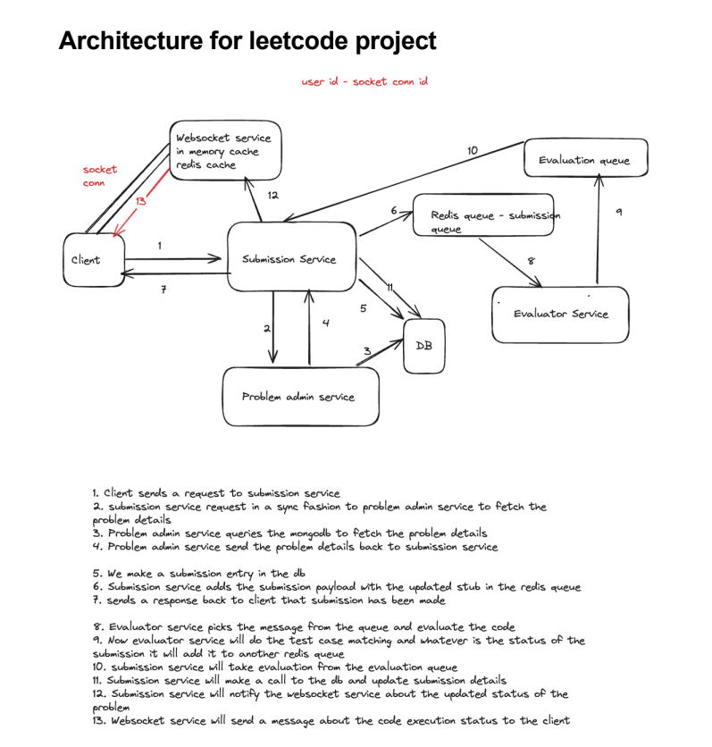

# LeetCode - Online Coding Platform

## Description

LeetCode is an online coding platform designed to allow users to engage with coding challenges and practice their programming skills. The platform uses a microservices architecture, leveraging containers and message queues for efficient processing.

## Table of Contents

- [LeetCode - Online Coding Platform](#leetcode---online-coding-platform)
  - [Description](#description)
  - [Table of Contents](#table-of-contents)
  - [Features](#features)
  - [Custom Sections](#custom-sections)
    - [How It Works](#how-it-works)
    - [Architecture Overview](#architecture-overview)
    - [Technologies Used](#technologies-used)
  - [Acknowledgements](#acknowledgements)

## Brief Overview

- **Microservices Architecture & Scalability** : Architected an advanced, highly scalable microservices-based platform for code compilation and execution, ensuring seamless scalability and high availability with AWS deployment and auto-scaling capabilities.

- **Dynamic Problem Administration** : Engineered a sophisticated Problem Admin Service using JavaScript, Express, and MongoDB to manage CRUD operations for problems, incorporating complex test cases and code stubs to facilitate comprehensive evaluation.

- **Advanced Code Execution** : Developed a cutting-edge Executor Service in TypeScript and Express, leveraging Docker containers to support multi-language code execution (Java, Python, C++). Employed Strategy and Factory design patterns to optimize execution environments and manage Time Limit Exceeded (TLE) conditions effectively.

- **High-performance Asynchronous Communication** : Designed a robust submission service with Fastify, handling a high volume of requests with exceptional performance. Utilized Redis message queues for efficient asynchronous communication, ensuring seamless integration between submission and executor services. Implemented WebSocket services to provide real-time feedback to users, enhancing interactivity and responsiveness.

- **AWS Deployment & Operational Excellence** : Deployed the entire system on AWS, utilizing auto-scaling groups, load balancers, and monitoring tools to ensure optimal performance, fault tolerance, and operational excellence.

## Features

- **Problem Statement Creation**: Users can create and manage coding problems.

- **Code Evaluation**: Docker containers are used to evaluate code submissions.

- **Result Processing**: Manages the submission and processing of results.

- **Real-time Feedback**: WebSocket services provide real-time feedback to users.

- **Scalability & High Availability**: AWS deployment ensures scalability and high availability.

- **Performance Optimization**: Redis message queues and Fastify services optimize performance.

- **Multi-language Support**: Supports code execution in Java, Python, and C++.

- **Operational Excellence**: Utilizes auto-scaling groups, load balancers, and monitoring tools for operational excellence.

- **Interactive User Interface**: Provides an interactive user interface for a seamless user experience.

- **Comprehensive Problem Administration**: Supports CRUD operations for problems, including test cases and code stubs.

- **Efficient Code Execution**: Optimizes execution environments and manages Time Limit Exceeded (TLE) conditions effectively.

- **Asynchronous Communication**: Utilizes Redis message queues for efficient asynchronous communication.

- **High-performance Submission Service**: Handles a high volume of requests with exceptional performance.

- **AWS Deployment**: Deploys the entire system on AWS for optimal performance and fault tolerance.

## Custom Sections

### How It Works

1. **Problem Creation**: Users create coding problems.
2. **Code Submission**: Users submit their code solutions.
3. **Code Evaluation**: Submitted code is evaluated in Docker containers.
4. **Result Submission**: Results are processed and returned to users.

### Architecture Overview

### Technologies Used

- **Frontend**: ReactJS, WebSocket
- **Backend**: Fastify, Express, TypeScript
- **Database**: MongoDB
- **Execution**: Docker, Java, Python, C++
- **Communication**: Redis, WebSocket
- **Deployment**: AWS

## Acknowledgements

Special thanks to the Mentors, resources and communities:
